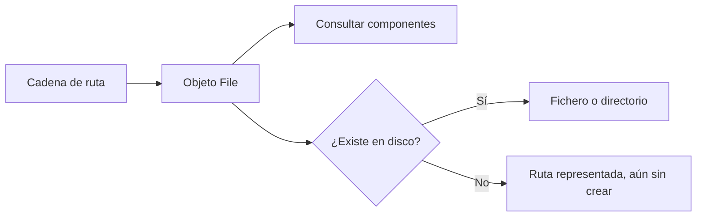
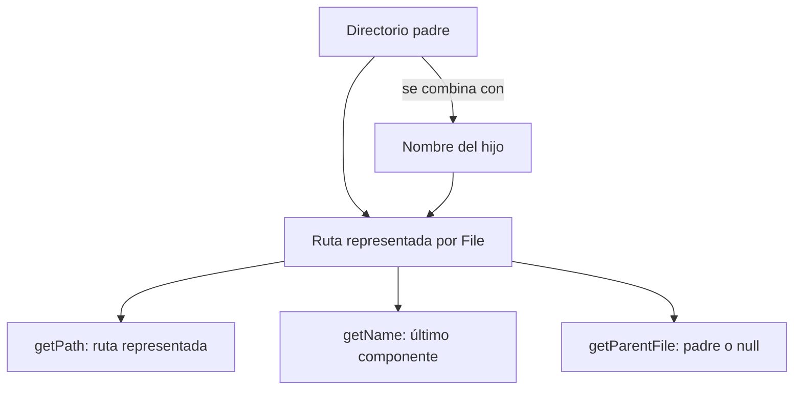

# Teoría · Rutas con `java.io.File`

## Qué representa un `File`

Un objeto `File` representa una ruta abstracta. Puede representar un fichero o
directorio que existe, uno que todavía no existe, o incluso una ruta inválida
para el sistema. **Construir el objeto no crea el elemento físico.**

## Rutas y directorios

Una ruta puede ser absoluta o relativa al directorio de trabajo del proceso. La
API permite representar una ruta con un único nombre o combinar un directorio
padre con el nombre de un hijo. También permite obtener el nombre, la ruta con
la que se construyó el objeto y el directorio padre.

| Constructor | Qué representa |
|---|---|
| `File(String ruta)` | Una ruta completa, relativa o absoluta |
| `File(String padre, String hijo)` | Un nombre hijo combinado con una cadena padre |
| `File(File padre, String hijo)` | Un nombre hijo combinado con un padre `File` |

## Detalles importantes

- Una ruta relativa se interpreta respecto al directorio de trabajo, que no
  tiene por qué ser la carpeta del archivo fuente.
- Los métodos que devuelven partes de una ruta describen el objeto `File`; no
  confirman que el elemento exista.
- Una ruta sin componente padre puede producir un padre `null`.
- Los separadores de ruta dependen del sistema. Para pruebas portables, compara
  objetos `File` construidos con la misma API en vez de inventar separadores.
- `getPath()` devuelve la representación conservada por el objeto; no la hace
  absoluta ni resuelve segmentos `.` o `..`.
- `getAbsolutePath()` la expresa desde la carpeta de trabajo actual. Esto tampoco
  garantiza que el destino exista.
- `getCanonicalPath()` puede normalizar la ruta y lanzar `IOException`; queda
  fuera de los métodos pedidos en este mini proyecto.

## Cómo se conecta con el ejercicio

`RutasFile.desdeRuta`, `desdeDirectorioYNombre` y `desdeDirectorioPadre` practican
los tres constructores. `nombre`, `rutaRepresentada` y `directorioPadre`
practican la consulta de componentes. Los tests verifican también que la
representación de una ruta no crea el elemento físico.

## Comprueba tu comprensión

- ¿Qué diferencia hay entre representar una ruta y crear el fichero?
- ¿Qué método puede devolver `null` cuando consultas el padre?
- ¿Qué información se pierde si conviertes una ruta relativa a absoluta?

## Apartado del temario

Esta teoría cubre únicamente los constructores de `File` y la representación y
descomposición de rutas del apartado 2.4. No incluye creación, listado,
`FilenameFilter` ni NIO.
