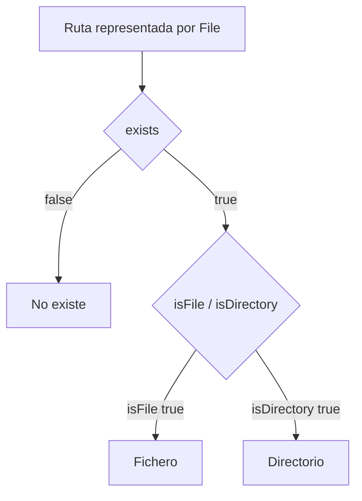
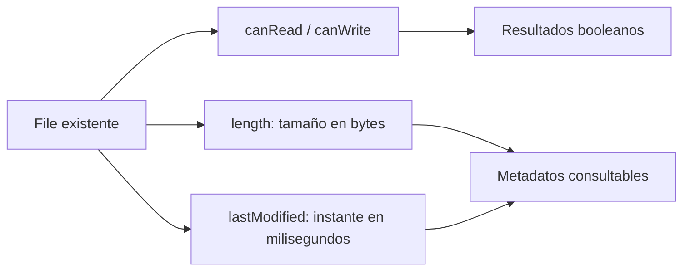

# Teoría · Inspeccionar rutas con `java.io.File`

## Estado y tipo

`File` permite preguntar al sistema de archivos si una ruta existe y si el
elemento es un fichero o un directorio. Son consultas distintas: una ruta puede
no existir, y una ruta existente puede ser de cualquiera de esos dos tipos.

## Permisos y metadatos

La clase ofrece consultas para saber si el proceso puede leer o escribir una
ruta y métodos para recuperar datos como el tamaño en bytes o la última fecha
de modificación.

## Interpretar los resultados

| Método | Resultado y límite |
|---|---|
| `exists()` | Si hay una entrada en esa ruta. |
| `isFile()` | Si la entrada es un fichero; falso para una ruta inexistente o un directorio. |
| `isDirectory()` | Si la entrada es un directorio; falso para una ruta inexistente o un fichero. |
| `canRead()` / `canWrite()` | Permisos que informa el sistema para el proceso actual. |
| `length()` | Tamaño del fichero en bytes; devuelve cero si no existe. El tamaño de directorio no es portable. |
| `lastModified()` | Fecha en milisegundos; devuelve cero si no existe o no se pudo determinar. |

- `isFile()` e `isDirectory()` describen tipos distintos; no deduzcas uno a
  partir del nombre o de la extensión.
- `canRead()` y `canWrite()` informan de permisos efectivos según el sistema,
  usuario y configuración de ejecución. No son una garantía de que una
  operación posterior vaya a completarse.
- Dos consultas seguidas pueden dar resultados distintos si otra aplicación
  modifica o borra la entrada entre ambas.

## Cómo se conecta con el ejercicio

`InspeccionFile` presenta una consulta por método. La suite de tests usa un
directorio temporal para preparar un fichero, un directorio y una ruta ausente;
así compara los resultados de cada caso sin depender del contenido de la carpeta
desde la que se ejecuta Maven.

## Comprueba tu comprensión

- ¿Por qué `exists()` no sustituye a `isFile()` o `isDirectory()`?
- ¿`canWrite()` garantiza que una escritura posterior vaya a completarse?
- ¿Un tamaño de cero significa siempre que la ruta no existe?

## Apartado del temario

Esta teoría cubre únicamente consultas y metadatos de la clase `File` del
apartado 2.4. No incluye operaciones de creación, filtrado ni NIO.
