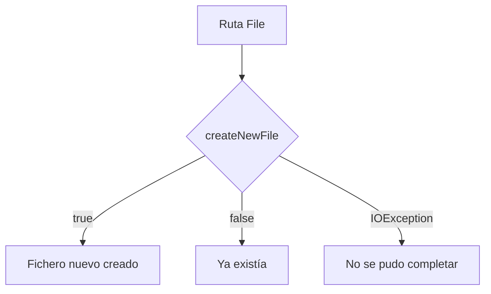
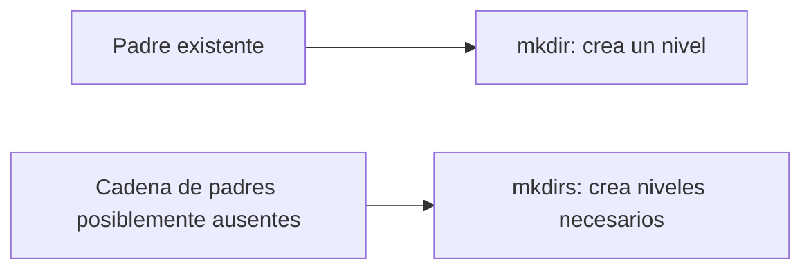

# Teoría · Operaciones con `java.io.File`

## Crear ficheros

`createNewFile()` intenta crear una entrada nueva y distingue entre haberla
creado y que ya existiera. Puede lanzar `IOException` si no se puede completar
la operación, por ejemplo, si falta el directorio padre.

La comprobación y la creación se realizan como una sola operación: es más seguro
que preguntar primero `exists()` y después crear, porque otra aplicación puede
crear el fichero entre esas dos acciones.

## Crear directorios

- `mkdir()` intenta crear un solo directorio y requiere que exista su padre.
- `mkdirs()` puede crear también los directorios padres que falten.
- Ambos devuelven un booleano; un resultado `false` no describe por sí solo la
  causa del fallo.

`mkdirs()` devuelve `false` cuando no se creó nada, por ejemplo porque la ruta ya
existía. Por eso conviene consultar el estado final si la aplicación necesita
distinguir “ya estaba preparado” de “no se pudo crear”.

## Renombrar y borrar

`renameTo(destino)` intenta cambiar la ruta de una entrada. Su resultado es
dependiente del sistema y conviene limitar el ejercicio a rutas del mismo
directorio y sistema de archivos. El mini proyecto define que no se sobrescriba
un destino existente.

`delete()` borra ficheros y directorios vacíos. Para un directorio no vacío,
primero habría que tratar sus entradas; esa eliminación recursiva no forma parte
de este ejercicio.

| Operación | Caso de éxito | Caso sin éxito |
|---|---|---|
| `createNewFile()` | Devuelve `true` si creó un fichero nuevo | Devuelve `false` si ya existía; puede lanzar `IOException` |
| `mkdir()` / `mkdirs()` | Devuelve `true` si creó directorio(s) | Devuelve `false`; hay que revisar la ruta y el estado final |
| `renameTo()` | Devuelve `true` si el cambio se completó | Devuelve `false`; su comportamiento depende del sistema |
| `delete()` | Devuelve `true` si se borró | Devuelve `false`; un directorio debe estar vacío |

## Cómo se conecta con el ejercicio

`OperacionesFileTest` cubre la creación repetida, la diferencia entre `mkdir` y
`mkdirs`, el renombrado dentro de una misma carpeta, la protección frente a un
destino existente y el borrado de ficheros frente a directorios no vacíos.

## Comprueba tu comprensión

- ¿Qué distingue `createNewFile()` cuando devuelve `false` de cuando lanza `IOException`?
- ¿Qué estructura de directorios prepara `mkdirs()` que `mkdir()` no prepara?
- ¿Por qué el ejercicio limita el renombrado a rutas del mismo directorio?

## Apartado del temario

Esta teoría se limita a crear ficheros y directorios, renombrar y borrar con
`File`. No incluye recorridos recursivos ni operaciones NIO.
