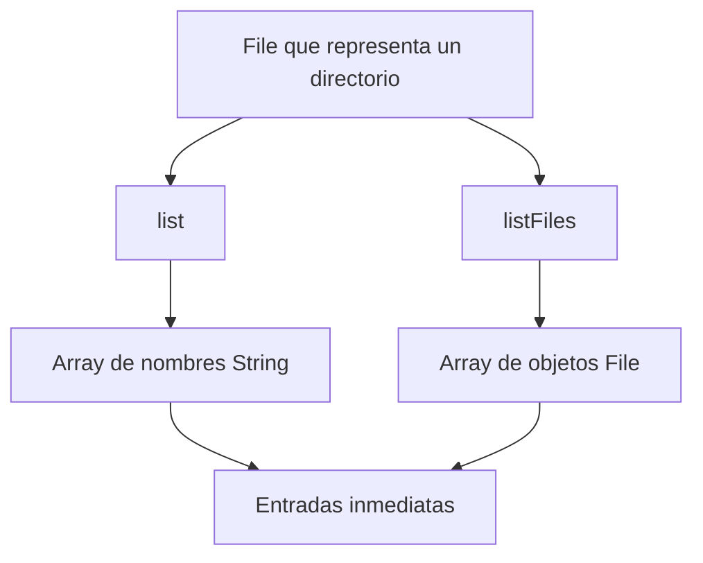
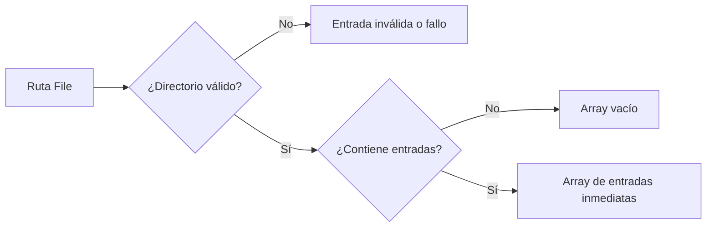

# Teoría · Listados de directorio con `java.io.File`

## `list()` y `listFiles()`

Ambos métodos enumeran las entradas inmediatas de un directorio. `list()` devuelve
sus nombres como cadenas; `listFiles()` devuelve un objeto `File` por entrada,
con el que después se puede consultar tipo y metadatos.

## Vacío frente a error

- Un directorio válido sin entradas produce un array vacío.
- Si la ruta no representa un directorio o el listado no puede obtenerse, los
  métodos pueden devolver `null`.
- El orden de los elementos que devuelve el sistema no está garantizado.
- Estos métodos no recorren de forma recursiva los subdirectorios.

| Resultado de la API | Interpretación |
|---|---|
| Array de longitud cero | El directorio se pudo consultar y no tenía entradas. |
| Array con elementos | El directorio se consultó y se encontraron entradas directas. |
| `null` | La ruta no era un directorio consultable o el sistema no pudo listar su contenido. |

Para que los tests y la salida de consola sean estables, los contratos de este
proyecto piden ordenar los resultados por nombre, sin depender del orden que
entregue el sistema.

El orden alfabético es una decisión del ejercicio, no una garantía de `File`.
Tampoco se filtran ficheros por extensión aquí: el filtro se estudia en el mini
proyecto `05-filtrado-filename-filter`.

## Cómo se conecta con el ejercicio

- `nombres` practica la variante `list()` y produce nombres.
- `entradas` practica `listFiles()` y produce objetos que se pueden inspeccionar.
- `estaVacio` enseña por qué un error (`null`) no debe confundirse con cero
  elementos.
- Los tests prueban orden, directorios vacíos, entradas inmediatas y argumentos
  que no representan directorios.

## Comprueba tu comprensión

- ¿Qué tipo de array devuelve cada método: `list()` y `listFiles()`?
- ¿Qué significa `null` frente a un array vacío?
- ¿El listado de una carpeta incluye automáticamente sus subdirectorios?

## Apartado del temario

Esta teoría se limita a `File.list()` y `File.listFiles()` para consultar el
contenido inmediato de directorios. No incluye `FilenameFilter` ni NIO.
