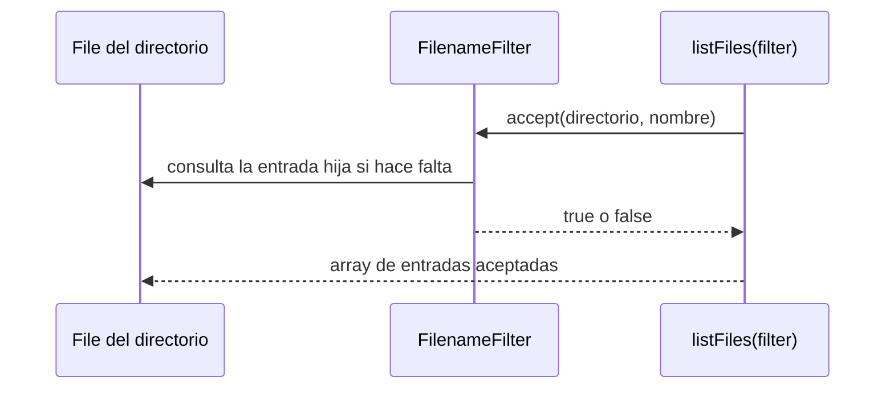
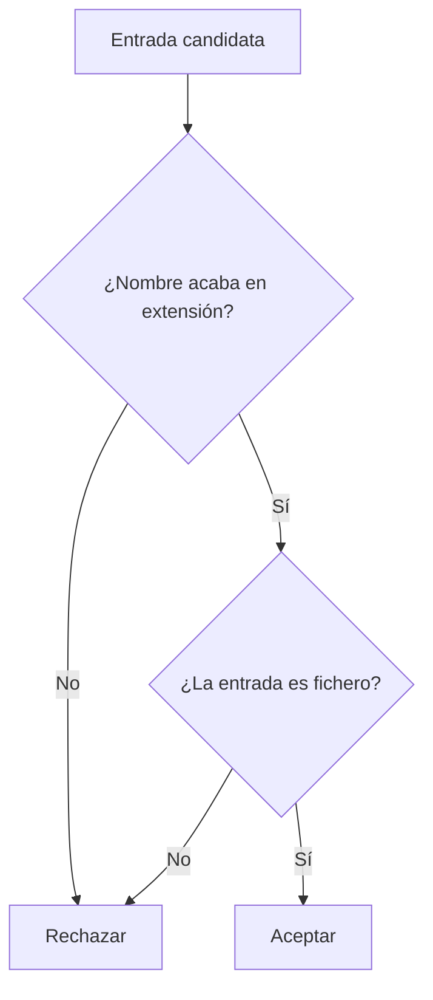

# Teoría · `FilenameFilter`

## El filtro como criterio de aceptación

`FilenameFilter` es una interfaz funcional de `java.io`. Su método `accept`
recibe el directorio padre y el nombre de una entrada; devuelve `true` si el
nombre debe formar parte del resultado.

## Nombre y tipo son comprobaciones diferentes

Un filtro por sufijo de nombre puede aceptar accidentalmente un directorio
llamado, por ejemplo, `copias.txt`. Si el contrato pide solo ficheros, además
del nombre hay que comprobar el tipo de la entrada. `accept` recibe el
directorio padre y el nombre, por lo que juntos identifican la entrada.

## Uso con `File`

`File.list(filter)` y `File.listFiles(filter)` delegan el criterio en el método
`accept`. El primero devuelve nombres y el segundo devuelve objetos `File`.
Como con los listados sin filtro, un array vacío significa que no hubo
coincidencias; `null` significa que no se obtuvo un listado válido.

El contrato de este mini proyecto usa extensiones que empiezan por punto,
compara sin distinguir mayúsculas y minúsculas, excluye directorios y ordena el
resultado para que sea reproducible.

La extensión normalizada debe ser independiente del idioma configurado en el
sistema. Para conversiones de mayúsculas/minúsculas usadas en identificadores,
Java recomienda `Locale.ROOT`; así una comparación como `.TXT` frente a `.txt`
no cambia por el idioma de la máquina.

## `FilenameFilter` frente a `FileFilter`

`FilenameFilter.accept` recibe por separado el directorio y el nombre. `FileFilter`
recibe un objeto `File` completo. Este ejercicio usa `FilenameFilter` porque es
la interfaz que aparece en UT02-A.

El filtro decide sobre cada entrada inmediata. No entra en subdirectorios ni
crea, mueve o borra archivos.

## Cómo se conecta con el ejercicio

- El constructor fija el criterio y rechaza extensiones que no cumplan el
  formato acordado.
- `accept` comprueba una entrada individual, por lo que permite tests precisos
  de ficheros, directorios y nombres que no existen.
- `listarPorExtension` integra el filtro con `File.listFiles(filter)`, detecta
  fallos de listado y ordena la salida como contrato del mini proyecto.

## Comprueba tu comprensión

- ¿Qué representan por separado los argumentos de `FilenameFilter.accept`?
- ¿Por qué un nombre terminado en `.txt` no demuestra que sea un fichero?
- ¿Qué resultado debe distinguir “no hay coincidencias” de “no se pudo listar”?

## Apartado del temario

Esta teoría se limita a `FilenameFilter` y su integración con `File.listFiles()`.
No incluye `FileFilter`, filtros NIO ni expresiones regulares.
