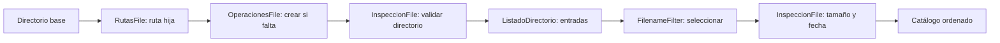

# Teoría · Catalogador de archivos

## Integrar las operaciones de `File`

El Boss final conecta los conceptos de la unidad: representa una ruta hija,
prepara un directorio, enumera sus entradas, filtra ficheros por extensión y
extrae metadatos para formar un catálogo inmutable.

## Contratos de integración

- Preparar una carpeta devuelve su `File`; si no existe, debe crear solo ese
  hijo bajo un padre que ya exista.
- Si el nombre solicitado ya corresponde a un fichero, no debe reemplazarse.
- Un catálogo incluye solo ficheros regulares aceptados por el filtro.
- La salida conserva un orden estable y no permite que quien la recibe altere
  la lista devuelta.
- Un fallo al listar el directorio se propaga como `IOException`; no se presenta
  como si no hubiese coincidencias.

Cada entrada del catálogo conserva cuatro datos consultables:

| Campo | Procedencia |
|---|---|
| Nombre | Último componente de la ruta |
| Ruta | Representación del objeto `File` |
| Tamaño | Bytes informados por el sistema |
| Última modificación | Milisegundos desde la época Unix |

El filtro y el listado operan sobre hijos directos. No se recorren carpetas
anidadas de forma recursiva.

## Cómo se conecta con el ejercicio

`prepararDirectorio` practica validación, construcción de ruta y creación
idempotente. `catalogar` integra listado, filtrado y metadatos. Los tests usan
una carpeta aislada con extensiones, tamaños y un directorio cuyo nombre también
termina en `.txt`.

## Comprueba tu comprensión

- ¿Qué debe ocurrir si ya existe un fichero con el nombre de la carpeta del catálogo?
- ¿Por qué una carpeta llamada `respaldo.txt` no aparece como fichero catalogado?
- ¿Qué ventaja tiene devolver una lista inmutable desde el catálogo?

## Alcance

Este ejercicio integra únicamente `java.io.File`, `FilenameFilter` y los mini
proyectos de UT02-A. No introduce persistencia NIO, recorridos recursivos ni
operaciones de base de datos.
