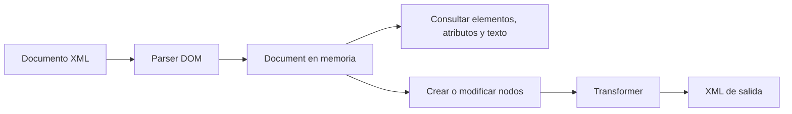
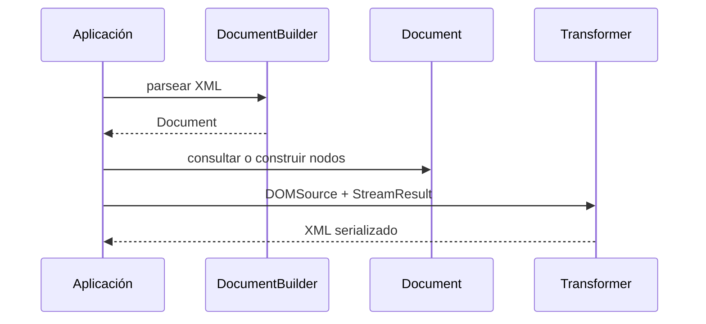

# Teoría · DOM en Java

## XML representado como árbol

DOM construye en memoria un árbol que representa el documento completo. El árbol
permite consultar elementos, atributos y texto, y también añadir o modificar
nodos antes de volver a serializar el documento.

## Nodos relevantes

- `Document` representa el documento entero y permite crear elementos y nodos de
  texto.
- `Element` representa una etiqueta y sus atributos.
- `NodeList` representa los nodos encontrados por una consulta; se recorre por
  índice.
- El texto de un elemento se obtiene desde el nodo correspondiente, no del
  nombre de la etiqueta.
- `Attr` representa un atributo asociado a un elemento.

El elemento raíz se obtiene desde `Document`. Una consulta de elementos puede
devolver varios resultados en orden documental; por eso el enunciado distingue
entre contar todas las coincidencias y recuperar la primera.

## Parsear, consultar y transformar

`DocumentBuilderFactory` permite obtener un `DocumentBuilder`, que parsea la
entrada y devuelve un `Document`. Para guardar el árbol como XML se conecta un
`DOMSource` con un `StreamResult` mediante `Transformer`.

El parser de este proyecto debe rechazar declaraciones `DOCTYPE`; no debe
resolver entidades externas. El XML mal formado o una configuración de parser
inválida se comunica como fallo y no como un documento vacío.
El manejador de errores debe propagar el problema como excepción sin imprimir
volcados de parser que oculten el mensaje de JUnit.

## Crear XML sin concatenar etiquetas

Para crear un documento se construye un `Document`, se crean elementos y nodos de
texto, y se conectan al padre mediante el árbol. Un `Transformer` convierte el
árbol a texto y se ocupa del escape XML del contenido. Esto evita tener que
escapar manualmente `&`, `<` y `>` al construir el XML.

## Qué comprueban los tests

| Método del ejercicio | Caso observado |
|---|---|
| `contarElementos` | Conteo de etiquetas existentes y ausentes |
| `obtenerAtributo` | Primer resultado, atributo ausente y etiqueta ausente |
| `textoPrimero` | Primer elemento en orden documental |
| `raizCoincide` | Coincidencia y discrepancia de raíz |
| `contarNodosElemento` | Conteo que incluye la raíz |
| `crearDocumento` | Árbol transformado y contenido escapado |
| Parser seguro | XML mal formado y `DOCTYPE` rechazado sin salida de diagnóstico extra |

## Comprueba tu comprensión

- ¿Qué ventaja da guardar el documento completo en un árbol `Document`?
- ¿Qué diferencia hay entre leer el texto de un `Element` y leer su atributo?
- ¿Qué adaptadores conectan el árbol DOM con la salida del `Transformer`?

## Apartado del temario

Esta teoría se limita a parseo y creación de DOM, consultas del árbol y escritura
con `Transformer`. No incluye SAX, StAX, JAXB ni XML con Jackson.
