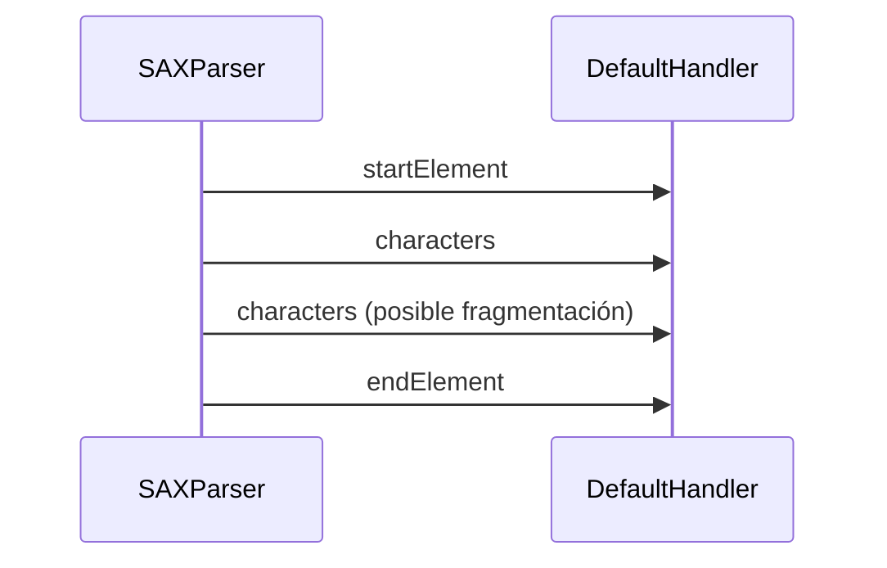

# Teoría · SAX en Java

## Lectura secuencial por eventos

SAX recorre el documento de principio a fin y avisa a un manejador cuando
encuentra un elemento, su texto u otros eventos. No crea un árbol completo en
memoria, por lo que resulta adecuado cuando se puede procesar el documento en
una sola pasada.

## Manejador y estado

Los métodos más usados del `DefaultHandler` son:

- `startElement`: inicio de etiqueta y acceso a sus atributos.
- `characters`: fragmento de texto recibido por el parser.
- `endElement`: cierre de etiqueta, punto natural para finalizar la acumulación
  del texto correspondiente.
- En `startElement`, `Attributes` permite consultar los atributos de la etiqueta
  que acaba de abrirse.

No se debe asumir que todo el texto de un elemento llega en una sola llamada a
`characters`. Un manejador debe acumular los fragmentos hasta el fin del
elemento. Si se necesita asociar texto o atributos al elemento actual, debe
mantener el estado mínimo para hacerlo.

Para extraer el texto de una etiqueta objetivo, el manejador necesita recordar si
está dentro de una coincidencia y acumular caracteres hasta que llegue el evento
de cierre. Para leer atributos basta con examinarlos en el evento de apertura;
para contar elementos se incrementa un contador al recibir cada apertura.

## SAX frente a DOM

| Aspecto | SAX | DOM |
|---|---|---|
| Lectura | Secuencial, basada en eventos | Árbol completo en memoria |
| Acceso | Avanza hacia delante | Consultas repetidas al árbol |
| Modificación | No modifica el árbol de entrada | Puede modificar el `Document` |
| Memoria | Conserva el estado necesario para el evento actual | Crece con el documento cargado |

Si la entrada está mal formada, el ejercicio debe propagar el error del parser.
No conviertas un documento inválido en una lista vacía: una lista vacía significa
que el XML sí se leyó correctamente, pero no había elementos coincidentes.
Configura el manejador de errores para que la traza no ensucie la salida de
consola; la excepción y el test deben explicar el fallo.

## Qué comprueban los tests

| Método del ejercicio | Caso observado |
|---|---|
| `textosDe` | Orden documental y texto con entidad XML decodificada |
| `atributosDe` | Atributos presentes y ausentes en distintos elementos |
| `contarElementos` | Conteo de nombres presentes y ausentes |
| Validación de entrada | Argumentos nulos/en blanco y XML mal formado |

## Apartado del temario

Esta teoría se limita a lectura SAX por eventos, atributos y acumulación de
texto. No incluye StAX ni binding JAXB.

## Comprueba tu comprensión

- ¿Qué información se recibe en `startElement` que no llega en `characters`?
- ¿Por qué el texto debe acumularse hasta `endElement`?
- ¿Qué capacidad pierdes al no guardar un árbol en memoria?
