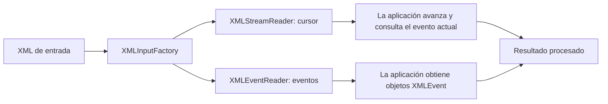
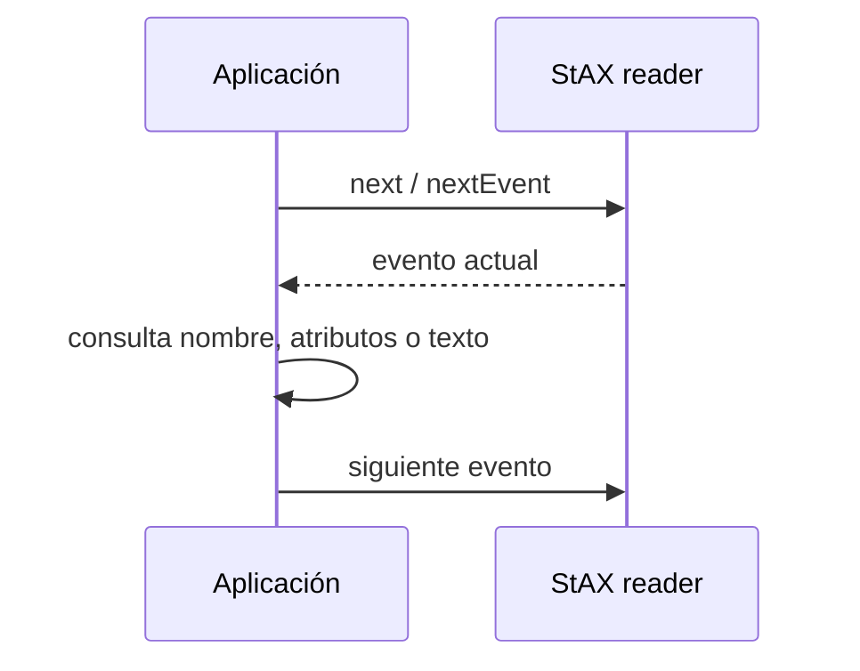

# Teoría · StAX en Java

## Procesamiento XML en streaming

StAX lee un documento secuencialmente, pero permite a la aplicación pedir los
siguientes eventos. No construye el árbol DOM completo. En un mismo flujo se
pueden consultar etiquetas, atributos y texto; no se vuelve automáticamente a
eventos anteriores.

## Cursor y lector de eventos

| Característica | Cursor | Iterador de eventos |
|---|---|---|
| API principal | `XMLStreamReader` | `XMLEventReader` |
| Avance | `next()` actualiza el evento actual | `nextEvent()` devuelve un objeto de evento |
| Datos de inicio | Métodos del reader, como nombre y atributo | `StartElement`, `QName` y `Attribute` |
| Coste orientativo | Menos objetos temporales | Cada evento se representa como objeto |
| Retroceso | No está disponible | El reader avanza; la aplicación podría guardar eventos |

En ambos estilos el documento avanza hacia delante. El cursor resulta apropiado
cuando interesa una lectura ligera y paso a paso. El iterador facilita pasar
eventos como objetos a distintas partes del programa.

## Leer contenido y atributos

El lector informa de eventos de inicio y fin de documento, inicio y fin de
elementos y fragmentos de caracteres. Los atributos se asocian al evento de
inicio. El texto puede dividirse en varios eventos de caracteres, por lo que un
lector genérico debe acumularlo hasta el cierre de la etiqueta.

`XMLStreamReader.getElementText()` y `XMLEventReader.getElementText()` son
atajos útiles para elementos simples: consumen el texto y avanzan hasta el
evento de fin correspondiente. Tras usarlos, el bucle no debe procesar otra vez
ese mismo final como si todavía fuese el evento actual.

## Escribir con StAX

StAX también proporciona dos formas de salida:

- `XMLStreamWriter` escribe eventos mediante llamadas sobre un cursor.
- `XMLEventWriter` recibe objetos creados, por ejemplo, con `XMLEventFactory`.

Ambas requieren mantener el orden correcto de inicio/cierre del documento y de
los elementos. El writer escapa el contenido textual como XML; los nombres de
elemento deben cumplir la sintaxis XML. Readers y writers deben cerrarse al
terminar, incluso si el procesamiento falla.

## Qué comprueban los tests

| Método | Caso observado |
|---|---|
| `titulosConCursor` | Extracción en orden usando el cursor |
| `atributosConCursor` | Lectura de atributos, incluidos los ausentes |
| `titulosConIterador` | Extracción consumiendo eventos `XMLEvent` |
| `atributosConIterador` | Atributos desde `StartElement` |
| `contarElementosConIterador` | Conteo de eventos de inicio |
| `crearDocumentoConCursor` | Escritura XML con `XMLStreamWriter` y escape de texto |
| `crearDocumentoConIterador` | Escritura con `XMLEventWriter` y lectura posterior |

## Comprueba tu comprensión

- ¿Quién controla el avance en SAX y quién lo controla en StAX?
- ¿Qué diferencia de representación hay entre cursor y lector de eventos?
- ¿Qué evento deja de ser actual tras usar `getElementText()`?
