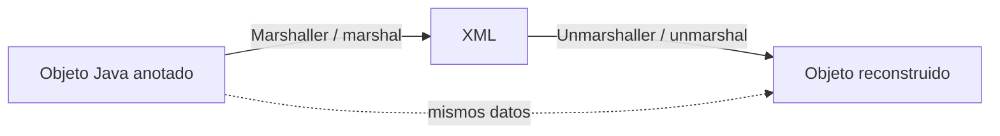
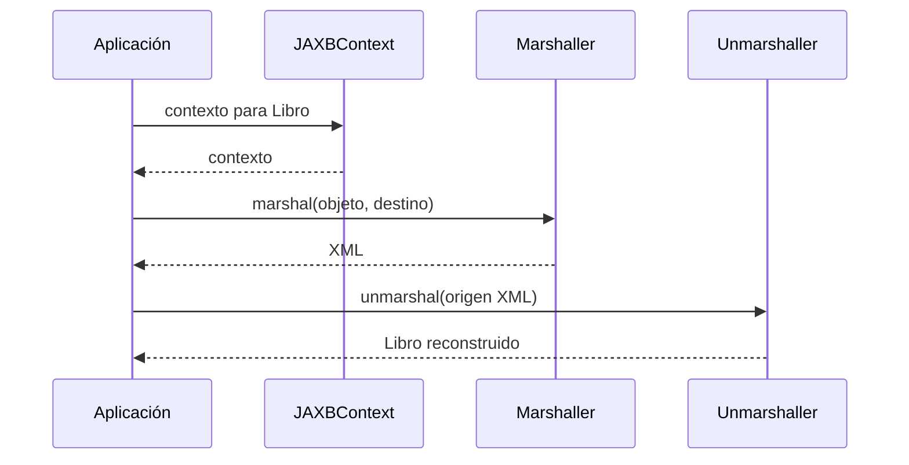

# Teoría · Enlace de datos XML con JAXB 2

## Del POJO al XML y vuelta

JAXB enlaza una clase Java con una estructura XML. `Marshaller` convierte el
objeto a XML; `Unmarshaller` reconstruye el objeto. La prueba fundamental es el
round-trip: los datos relevantes deben conservarse en ambos sentidos.



## Anotaciones usadas por el ejercicio

| Anotación | Función |
|---|---|
| `@XmlRootElement` | Asocia la clase con el elemento raíz |
| `@XmlAccessorType(XmlAccessType.FIELD)` | Indica que el binding observa los campos |
| `@XmlAttribute` | Representa un campo como atributo XML |
| `@XmlElement` | Representa un campo como elemento hijo |
| `@XmlType(propOrder = ...)` | Define el orden de los elementos al serializar |

El `Unmarshaller` necesita poder crear el objeto. Por eso el modelo `Libro`
mantiene un constructor público sin argumentos. Las anotaciones del ejercicio
usan acceso a campos, de modo que no es necesario crear setters para los
atributos del modelo.

La forma XML del modelo de este ejercicio es:

```xml
<libro isbn="978-84">
    <titulo>Clean Code</titulo>
    <anio>2008</anio>
</libro>
```

## Contexto y operaciones

`JAXBContext` se crea para las clases de modelo que participan en el binding. De
él se obtienen un `Marshaller` y un `Unmarshaller`. El destino/origen puede ser
un `Writer` o un stream, por lo que JAXB puede producir una cadena o trabajar
con un fichero.



## Propiedades y límites de los retos extra

- `JAXB_FORMATTED_OUTPUT` hace más legible el XML.
- `JAXB_FRAGMENT` omite la declaración XML en la salida.
- `JAXB_ENCODING` configura la codificación declarada al serializar. En este
  proyecto se prueba la declaración de un `StringWriter`; si se necesitan bytes
  reales ISO-8859-1, el destino debe ser un `OutputStream` configurado como tal.
- `compactarXml` es un reto de texto basado en espacios en blanco, no un
  formateador XML seguro: un parser/transformer es la herramienta adecuada para
  modificar documentos XML.
- `esXmlDeLibro` conserva la utilidad heurística de la Masterclass; buscar una
  subcadena no valida que un documento sea XML bien formado.
- El clon usa marshal/unmarshal para obtener una instancia distinta con los
  mismos valores, no una serialización Java de objetos.

JAXB 2 usa `javax.xml.bind` y desde Java 11 requiere librerías externas. Este
proyecto declara API y runtime JAXB 2.3, igual que el laboratorio DAM2. La
Masterclass actual usa `jakarta.xml.bind`; aquí se adapta el paquete, no el
concepto.

## Qué comprueban los tests

La suite procede de `Ej143JaxbBindingTest` e incluye las dos operaciones base y
los diez retos extra. Se corrigió una aserción contradictoria del test original
de compactación: la especificación que coincide con la transformación de espacios
es `<libro> </libro>`.

## Comprueba tu comprensión

- ¿Qué diferencia hay entre atributo XML y elemento hijo en el modelo `Libro`?
- ¿Qué condición necesita una clase para que JAXB pueda reconstruirla?
- ¿Qué demuestra que un round-trip conserva los datos y crea una instancia nueva?
